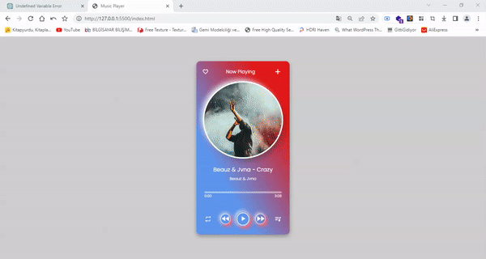

<h1>Music Player</h1>

<h3>Kullanılan Teknolojiler</h3>
<h3>JavaScript - HTML5 - CSS3</h3>

    Bu, oynatma, duraklatma ve parçalar arasında geçiş yapma gibi temel işlevlere sahip bir müzik çalar oluşturan bir JavaScript kodudur. 
    Oynat/duraklat düğmesine tıklandığında sesin duraklatılıp duraklatılmadığını kontrol eder ve ilgili işlevi çağırır. Sonraki/önceki düğmesine tıklandığında ilgili işlevi çağırır. timeupdate olayı başlatıldığında, ses dosyasının geçerli saatini ve süresini hesaplar ve ilerleme çubuğunun genişliğini ve şarkının geçerli ve toplam süresini günceller. 
    Kod ayrıca tekrar düğmesindeki tıklama olayını da işler ve müzik çaların durumuna göre simgesini değiştirir. Ses dosyası sona erdiğinde, tekrar düğmesinin durumunu kontrol eder ve bir sonraki şarkıyı çalmak veya mevcut şarkıyı tekrarlamak için ilgili işlevi çağırır. 
    Müzik listesi seçeneği ile liste üzerinden kullanıcı isteğine göre dinamik olarak sanatçı ve parça seçme imkanı tanımaktadır.

<a href="https://js-music-player1.netlify.app/">Canlı Önizleme</a>

